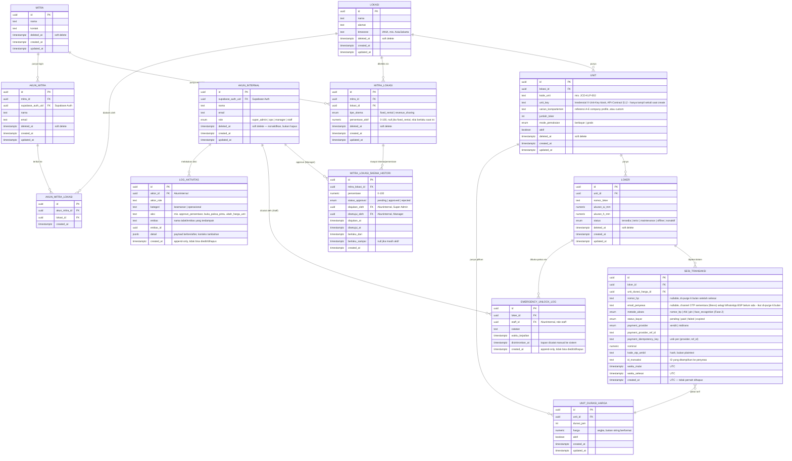

# ERD — Smartbox (Sewa Smart Locker)

**Sumber:** diturunkan dari `docs/PRD-Smartbox.md` §6 (Model Data Inti) dan seluruh keputusan arsitektur yang sudah dikunci di PRD (soft delete, timezone per lokasi, status loker 5-nilai, retensi nomor HP 6 bulan, skema bagi hasil dinamis, role Manager/Staff, dsb.).
**Target implementasi:** PostgreSQL (Supabase, lihat PRD §9.2) — enum sebaiknya dibuat sebagai Postgres `ENUM` type, RLS policy per tabel mengikuti aturan isolasi di PRD §7.

---

## Diagram

---

## Catatan desain per entitas

### `LOKASI`
- `timezone` wajib diisi manual oleh Super Admin saat pendaftaran lokasi baru (PRD §7.2) — jangan asumsikan `Asia/Jakarta` sebagai default diam-diam, paksa pengisian eksplisit di form.

### `MITRA` & `MITRA_LOKASI`
- `tipe_skema` dan `persentase_aktif` sengaja diletakkan di level **relasi Mitra–Lokasi**, bukan di `MITRA` langsung — satu mitra secara teori bisa punya lebih dari satu lokasi dengan skema berbeda (PRD §10).
- `persentase_aktif` di `MITRA_LOKASI` adalah **nilai cache/snapshot** dari histori yang sedang berlaku (baris `MITRA_LOKASI_SKEMA_HISTORI` dengan `berlaku_sampai IS NULL` dan `status_approval = 'approved'`) — memudahkan query laporan tanpa join histori setiap saat, tapi **sumber kebenaran tetap tabel histori**.
- Validasi `persentase_aktif`/`persentase` di kedua tabel: `CHECK (persentase >= 0 AND persentase <= 100)` di level database, jangan andalkan validasi frontend saja (PRD §12 poin 2).

### `MITRA_LOKASI_SKEMA_HISTORI`
- Ini yang menjawab kebutuhan PRD §10: "idealnya punya riwayat perubahan... perlu tabel/versi histori". Setiap pengajuan persentase baru = baris baru dengan `status_approval = 'pending'`; hanya berubah jadi `approved` setelah role Manager menyetujui (`disetujui_oleh` harus FK ke `AkunInternal` dengan `role = 'manager'`, ditegakkan di aplikasi/trigger).
- Baris lama yang digantikan diberi `berlaku_sampai` saat baris baru disetujui — bukan diedit/dihapus, supaya riwayat lengkap untuk audit (selaras prinsip append-only di PRD §7.1).

### `UNIT` & `UNIT_DURASI_HARGA`
- `varian_kompartemen` disimpan sebagai teks bebas (bukan enum tertutup 5 varian A–E), sesuai catatan PRD §8.3: dimensi bisa custom per proyek.
- `UNIT_DURASI_HARGA` terpisah dari `UNIT` supaya satu unit bisa punya beberapa pilihan durasi & harga (mis. 3 jam / 6 jam / 1 hari), sesuai alur kiosk §5.1 langkah 4.
- `mode_pemakaian = 'gratis'` (PRD §4.4a): saat ini, `SESI_TRANSAKSI` untuk unit mode ini tetap dibuat (agar okupansi tercatat) tapi `status_bayar` langsung `paid` tanpa proses provider, dan `nominal = 0` — laporan (§5.4/§5.5) harus membedakan ini dari transaksi berbayar asli via `unit_durasi_harga.harga` yang jadi rujukan, bukan asumsi status_bayar saja.

### `LOKER`
- `status` adalah Postgres `ENUM` 5 nilai resmi (PRD §12 poin 9) — **jangan** dibuat sebagai `text` bebas, supaya nilai yang tidak valid ditolak di level database, bukan cuma di validasi aplikasi.

### `SESI_TRANSAKSI`
- **Tidak punya kolom `deleted_at`** — baris ini tidak pernah di-soft-delete apalagi hard-delete (PRD §6). Yang berubah seiring waktu hanya `nomor_hp` (di-null-kan otomatis oleh scheduled job setelah 6 bulan, PRD §7).
- `payment_idempotency_key` + constraint `UNIQUE (payment_provider, payment_provider_ref_id)` mencegah transaksi dobel dari retry webhook (PRD §9.3).
- `kode_otp_ambil` disimpan **hash** (bukan plaintext) meski berlaku cuma 5 menit — praktik keamanan dasar, jangan simpan kredensial sekali-pakai apa adanya.
- `metode_akses` disiapkan sebagai enum multi-nilai sejak awal (bukan cuma `nomor_hp`) supaya penambahan RFID/PIN/Face Recognition di Fase 2 (PRD §4.2) tidak perlu migrasi skema besar — nilai `face_recognition` ada di enum tapi belum dipakai sampai diverifikasi hardware (PRD §12 poin 6).

### `AKUN_INTERNAL` & `AKUN_MITRA`
- Keduanya **tidak menyimpan password** — autentikasi didelegasikan penuh ke Supabase Auth (`supabase_auth_uid`), sesuai PRD §9.2.
- `role` di `AKUN_INTERNAL` dibatasi ke 4 nilai (`super_admin`, `ops`, `manager`, `staff`) — hanya endpoint yang dijalankan atas nama `super_admin` yang boleh menulis ke tabel ini (PRD §7, §9.2).
- `AKUN_MITRA_LOKASI` adalah tabel junction karena satu akun mitra "terikat ke 1+ lokasi" (PRD §6 asli) — bukan relasi 1-ke-1.

### `EMERGENCY_UNLOCK_LOG` & `LOG_AKTIVITAS`
- Keduanya **append-only** secara desain — di level aplikasi tidak ada endpoint `UPDATE`/`DELETE` untuk tabel ini; kalau perlu proteksi lebih ketat, tambahkan Postgres `REVOKE UPDATE, DELETE` untuk role aplikasi di kedua tabel ini (PRD §7.1).
- `LOG_AKTIVITAS` sengaja **satu tabel untuk dua tujuan** (audit keamanan §7.1 dan activity log operasional §5.6) dibedakan lewat kolom `kategori` — sesuai catatan PRD §5.6 bahwa keduanya "bisa berbagi tabel penyimpanan yang sama".

---

## Yang belum final (mengikuti risiko PRD §12)

- Struktur `varian_kompartemen`/`ukuran_w_mm`/`ukuran_h_mm` di `UNIT`/`LOKER` masih indikatif — perlu disesuaikan begitu vendor hardware final dikontrak (PRD §12 poin 1), karena field fisik yang tercatat vendor bisa lebih rinci dari asumsi saat ini.
- `metode_akses = 'face_recognition'` ada di enum tapi berstatus **belum terverifikasi** (PRD §12 poin 6) — jangan aktifkan di UI sampai konfirmasi hardware.
